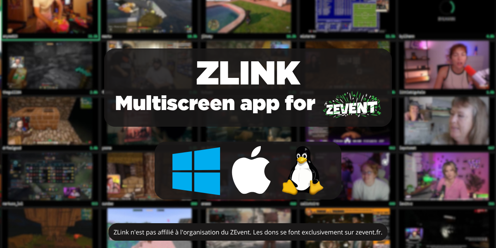
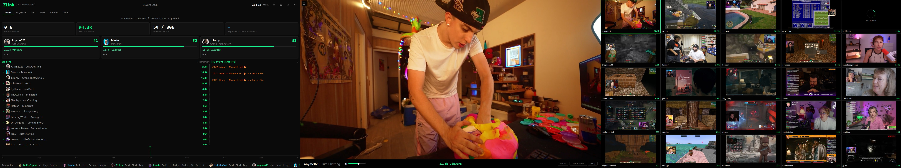

<p align="center">
  <a href="LICENSE"></a>
  
  
  
</p>

---

**ZLink** est un panel de régie : les flux en direct, les chiffres et le
programme au même endroit, et des alertes qui préviennent au moment où quelque
chose arrive plutôt qu'après.

Il s'adapte au nombre d'écrans. Sur trois, la grille, le plein écran et le panel
ont chacun le leur. Sur deux, le panel accompagne le plein écran. Sur un seul,
les trois vues cohabitent et l'on bascule de l'une à l'autre.

<p align="center">
  
</p>

<p align="center">
  <sub>Le mode trois écrans : panel de régie, plein écran, grille des directs.</sub>
</p>

## Ce que ça fait

### Regarder

Une grille de flux en direct — seize par défaut, jusqu'à vingt-cinq — un plein
écran, et un mode tableau de bord façon régie ZEvent : cagnotte à l'odomètre,
bandeau des chaînes en direct, donation goals sur le point de tomber.

La vidéo passe par libmpv avec le décodage matériel, pas par un navigateur, et
la qualité se règle séparément pour la grille et pour le plein écran.

La grille se trie par spectateurs, à la main par glisser-déposer, ou favoris
d'abord puis à la main. Les compositions se gardent en préréglages.

Le plein écran a son menu latéral de chaînes navigable au clavier, le chat
Twitch en panneau redimensionnable, et une incrustation quand on rejoue un
moment.

### Écouter

Une console de mixage pour les audios épinglés, tranche par tranche : curseur
de volume, coupure, désépinglage — y compris pendant le plein écran. La liste
des chaînes dont l'audio est épinglé reste affichée en haut à droite, avec leur
photo et leur nom.

### Être prévenu

Neuf familles d'alertes, chacune désactivable :

| Alerte | Ce qui vient de se passer |
|---|---|
| **Moment fort** | Le chat d'une chaîne s'emballe : bien plus de messages que son rythme habituel. Il se passe quelque chose. |
| **Palier de cagnotte** | La cagnotte du ZEvent vient de franchir un chiffre rond — 250 k€, 1 M€, 2 M€… |
| **Afflux de dons** | Une chaîne encaisse une grosse somme en quelques minutes. Un bombardement de petits dons est signalé comme tel, pas confondu avec un don unique. |
| **Donation goal imminent** | Un goal est sur le point de tomber : il reste moins de 500 € à récolter, ou il est rempli à plus de 98 %. C'est le moment d'aller voir. |
| **Donation goal atteint** | Un goal vient d'être rempli. |
| **Un favori lance son direct** | Une chaîne que vous avez mise en favori vient de passer en ligne. Un bandeau propose de basculer dessus ; si vous ne cliquez pas, il disparaît tout seul. |
| **Un show commence** | Un rendez-vous du programme démarre — proposition de basculer sur la chaîne qui le présente. |
| **Raid** | Une chaîne du ZEvent envoie ses spectateurs vers une autre chaîne du ZEvent. Les raids venus de l'extérieur sont ignorés. |
| **Entrée dans le top 3** | Une chaîne fait irruption dans les trois plus grosses audiences de l'événement. C'est rare, et ça veut dire qu'il se passe quelque chose de gros. |

Tout se règle : le score à partir duquel un moment fort est signalé, le délai
minimum entre deux alertes d'une même chaîne, le nombre maximum d'alertes par
heure, le montant à partir duquel un don compte.

ZLink repère aussi les **coupures publicitaires** de la chaîne regardée : un
bandeau prévient pendant la pub, un mot signale qu'elle est finie. Aucune vidéo
n'est téléchargée pour ça — seule la playlist HLS est relue toutes les trois
secondes, et une pub n'est annoncée qu'après confirmation, pour ne pas crier
sur un faux positif.

Et l'on peut **s'abonner à un rendez-vous du programme** : ZLink prévient cinq
minutes avant qu'il commence, et se souvient des abonnements d'une session à
l'autre.

### Garder les moments

Un clip des dernières secondes s'enregistre d'une touche, en grille comme en
plein écran, avec une durée et un dossier de son choix. Ils peuvent aussi se
déclencher tout seuls sur alerte : désactivé par défaut, et plafonné à un
nombre par heure, pour ne pas remplir le disque une nuit de ZEvent.

Le replay rejoue les dernières secondes en plein écran tout en gardant le
direct en incrustation. À la fermeture, un récapitulatif de session est écrit :
temps passé sur chaque chaîne, moments forts, donation goals vus tomber, pic de
spectateurs.

### Suivre les chiffres

Évolution de la cagnotte et des spectateurs en courbes, comparaison LAN contre
en ligne, classement des chaînes, top des audiences. Le programme s'affiche en
timeline autour de l'heure courante. Chaque participant a sa fiche : courbe de
dons sur la session, donation goals, passages au programme, moments forts.

Un fil chronologique garde ce qui s'est passé, et un bandeau défilant résume
l'essentiel en haut du panel.

### Confort

Palette de commandes au clavier (`Ctrl`+`K`) pour sauter à une chaîne, un
onglet ou une action. Favoris, filtres et recherche dans la liste des chaînes.
Assistant au premier démarrage pour choisir les écrans, le nombre de flux et
les alertes. Et l'en-tête signale discrètement qu'une nouvelle version est
publiée.

## Installation

Téléchargez l'archive de votre système dans les
[versions publiées](../../releases), décompressez-la, lancez `ZLink`.

**Vérifiez l'intégrité avant d'exécuter.** Chaque archive est accompagnée d'une
signature Ed25519 (`.sig`) et son empreinte figure dans `SHA256SUMS`.

| | |
|---|---|
| **Windows** | Aucune installation. Le dossier est autonome et se déplace, y compris sur une clé. |
| **macOS** | Glissez `ZLink.app` dans Applications. |
| **Linux** | `mpv` doit être présent sur le système : `dnf install mpv` ou `apt install libmpv2`. |

Au premier lancement, un assistant demande quels écrans utiliser, combien de
flux dans la grille et quelles alertes activer. Il se rejoue par `--setup`.

## Depuis les sources

```bash
git clone https://github.com/fabienmillet/ZLink
cd ZLink
python -m venv .venv && source .venv/bin/activate
pip install -r requirements.txt
python main.py
```

`libmpv` doit être installée sur le système. Sous Windows la bibliothèque
voyage avec l'application et son empreinte est vérifiée au démarrage
(`core/libmpv_check.py`).

| Option | |
|---|---|
| `--setup` | rejoue l'assistant de premier démarrage |
| `--mock` | données simulées, sans réseau |

| Variable | |
|---|---|
| `ZLINK_CONFIG` | déplace le fichier de configuration — second profil, ou bancs d'essai qui ne doivent pas toucher la configuration réelle |
| `ZLINK_MPV_LOG` | journal de libmpv |

Pour construire un paquet autonome :

```bash
pip install pyinstaller
pyinstaller --noconfirm --clean ZLink.spec
```

## Raccourcis en plein écran

| | | | |
|---|---|---|---|
| `←` `→` | chaîne précédente / suivante | `C` | garder un clip du moment |
| `1`–`9` | basculer sur un emplacement | `R` | rejouer les dernières secondes |
| `+` `-` | volume | `F` | mettre en favori |
| `M` | couper le son | `Échap` | quitter le replay, puis le plein écran |

## Données

| Source | |
|---|---|
| [zevent.fr](https://zevent.fr) | cagnotte, spectateurs, état des directs |
| [InGDoc — evenmorestats](https://gdoc.fr) | programme, participations, donation goals, avatars |

Aucune clé d'API n'est nécessaire. ZLink ne lit que des données publiques, ne
collecte rien et n'envoie rien ailleurs que vers ces deux services.

## Licence

**GNU GPL v3 ou ultérieure.** Copyright © 2026 Fabien MILLET.

Logiciel libre : utilisation, étude, modification et redistribution garanties,
à condition que les versions dérivées restent sous la même licence et que leurs
sources soient fournies. Voir [LICENSE](LICENSE).

---

<sub>ZLink n'est pas affilié à l'organisation du ZEvent. Les dons se font
exclusivement sur <a href="https://zevent.fr">zevent.fr</a>.</sub>
